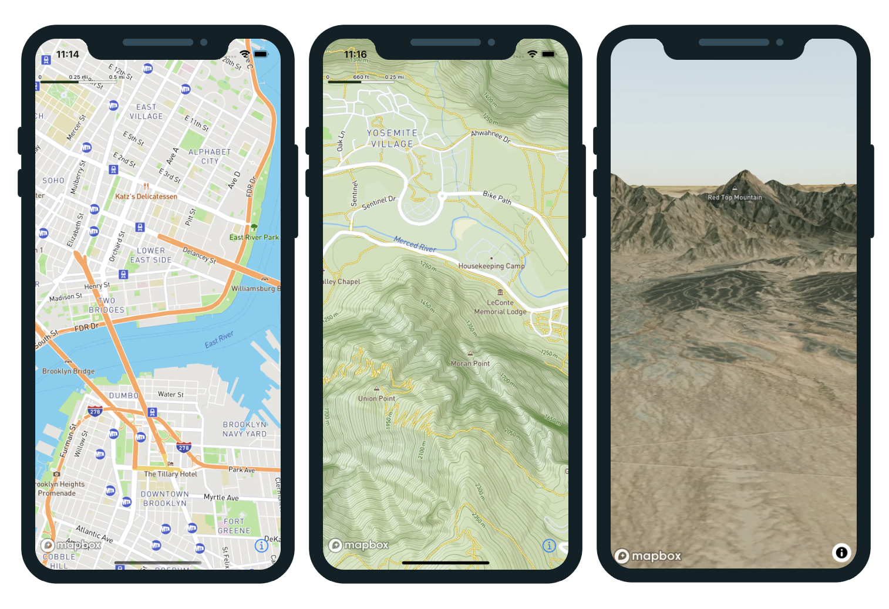
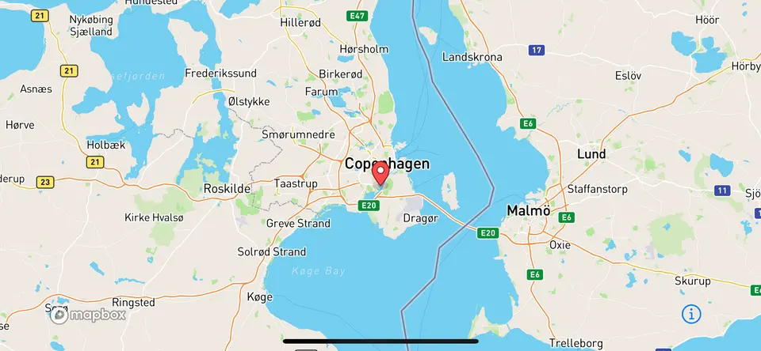
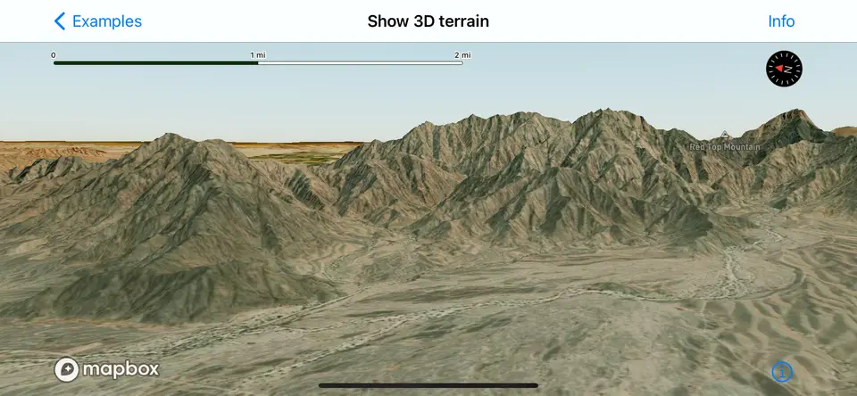
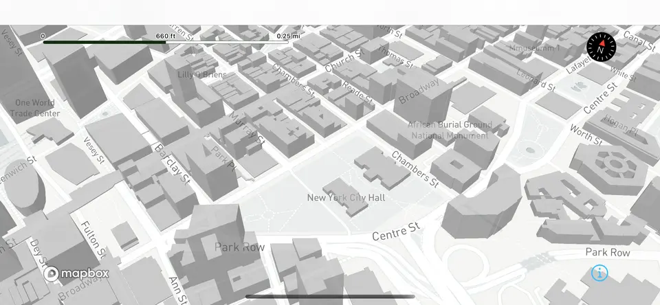
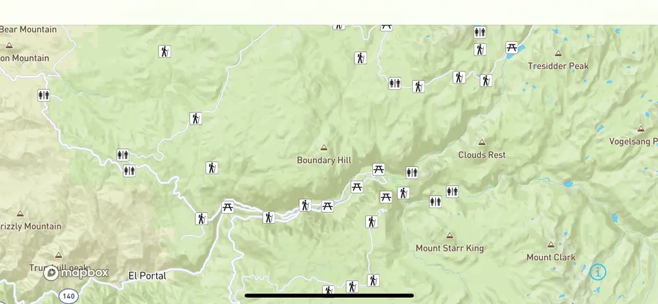

# Mapbox Maps SDK for React Native

<table style="border: none; border-width: 0px">
<tr style="border: none; border-width: 0px">
<td style="border: none; border-width: 0px">

</td>
<td style="border: none; border-width: 0px">

</td>
</tr>
</table>

|  [](https://badge.fury.io/js/%40rnmapbox%2Fmaps)  | [](https://github.com/rnmapbox/maps/actions/workflows/on-push.yml?branch=main)  |
|---|---|


_A community-supported, open-source React Native library for building maps with the [Mapbox Maps SDK for iOS](https://www.mapbox.com/ios-sdk/) and [Mapbox Maps SDK for Android](https://www.mapbox.com/android-sdk/)_

---
## News & Discussions
#### <span style="color:red">&rarr;</span> Call for additional maintainers [discussion thread](https://github.com/rnmapbox/maps/discussions/1551)

---

<table>
<tr>
<td colspan="2" align="center">

</td>
</tr>
<tr>
<td>

</td>
</tr>
<tr>
<td>

</td>
</tr>
<tr>
<td>

</td>
</tr>

<tr>
<td>

</td>
</tr>
</table>

---

### Supported Implementations 
At the moment we support Mapbox (v10) and Mapbox (v11) beta.
We default to Mapbox (v10).

_See [iOS](ios/install.md) & [Android](android/install.md) setup guide for using v11 beta_


## Prerequisite

1. Please [Sign Up to Mapbox](https://account.mapbox.com/auth/signup/) to get the Mapbox Access Token.


## Dependencies

- [node](https://nodejs.org)
- [npm](https://www.npmjs.com/)
- [React Native](https://facebook.github.io/react-native/) (0.70+, older versions from 0.64+ might or might not work)


## Installation

Check our [Installation instructions](https://rnmapbox.github.io/docs/install)

### Getting Started
For more information, check out our [Getting Started](/docs/GettingStarted.md) section

## Run Project
Before you run your project be sure you have completed the Installation Guides for Android or iOS.

### Run iOS Simulator
```sh
# Run with yarn
yarn run ios

# or Run with NPM
npm run ios
```

### Run Android Emulator
```sh
# Run with yarn
yarn run android

# or Run with NPM
npm run android
```

## Adding a map
```js
import React from 'react';
import { StyleSheet, View } from 'react-native';
import Mapbox from '@rnmapbox/maps';

Mapbox.setAccessToken('<YOUR_ACCESSTOKEN>');

const App = () => {
  return (
    <View style={styles.page}>
      <View style={styles.container}>
        <Mapbox.MapView style={styles.map} />
      </View>
    </View>
  );
}

export default App;

const styles = StyleSheet.create({
  page: {
    flex: 1,
    justifyContent: 'center',
    alignItems: 'center',
  },
  container: {
    height: 300,
    width: 300,
  },
  map: {
    flex: 1
  }
});
```
---
## Documentation

### Components

- [MapView](/docs/MapView.md)
- [StyleImport](/docs/StyleImport.md)
- [Light](/docs/Light.md)
- [StyleSheet](/docs/StyleSheet.md)
- [PointAnnotation](/docs/PointAnnotation.md)
- [MarkerView](/docs/MarkerView.md)
- [Callout](/docs/Callout.md)
- [Camera](docs/Camera.md)
- [UserLocation](docs/UserLocation.md)
- [LocationPuck](docs/LocationPuck.md)
- [Images](docs/Images.md)
- [Image](docs/Image.md)
- [Models](docs/Models.md)

### Sources

- [VectorSource](/docs/VectorSource.md)
- [ShapeSource](/docs/ShapeSource.md)
- [RasterSource](/docs/RasterSource.md)
- [RasterDemSource](/docs/RasterDemSource.md)

### Layers

- [BackgroundLayer](/docs/BackgroundLayer.md)
- [CircleLayer](/docs/CircleLayer.md)
- [FillExtrusionLayer](/docs/FillExtrusionLayer.md)
- [FillLayer](/docs/FillLayer.md)
- [LineLayer](/docs/LineLayer.md)
- [RasterLayer](/docs/RasterLayer.md)
- [SymbolLayer](/docs/SymbolLayer.md)
- [HeatmapLayer](/docs/HeatmapLayer.md)
- [SkyLayer](/docs/SkyLayer.md)
- [ModelLayer](/docs/ModelLayer.md)

### Terrain

- [Terrain](/docs/Terrain.md)
- [Atmosphere](/docs/Atmosphere.md)

### Offline

- [OfflineManager](/docs/OfflineManager.md)
- [SnapshotManager](/docs/snapshotManager.md)

### Misc

- [Mapbox](/docs/Mapbox.md)
- [CustomHttpHeaders](/docs/CustomHttpHeaders.md)
- [Logger](/docs/Logger.md)

## Expo Support

This package is not available in the [Expo Go](https://expo.io/client) app. Learn how you can use it with [custom dev clients](/plugin/install.md).

## Testing with Jest

This library provides some mocks which are necessary for running tests.

Example:

```json
"jest": {
  "preset": "react-native",
  "setupFilesAfterEnv": ["@rnmapbox/maps/setup-jest"],
  "transformIgnorePatterns": [
      "node_modules/(?!(...|@rnmapbox))"
  ]
}
```
---
## Sponsors

Help drive this repo forward - be a sponsor. Add a comment [here](https://github.com/rnmapbox/maps/discussions/1551) to discuss your sponsorship.

<table style="border: none; border-width: 0px">
<tr>
<td align="center">
<a href="https://scouttohunt.com/" target="_blank">

      
</td>
<td align="center">
<a href="https://terrain.dance/" target="_blank">

  </a>

  
</td>
</tr>
<tr>
<td align="center"></a>

  <a href="https://scouttohunt.com/" target="_blank">Scout To Hunt</a></td>

<td align="center"><a href="https://terrain.dance/" target="_blank">Terrain Dance</a></td>
</tr>
</table>

---
## Developer Group

Have a question or need some help? Use [Github discussions](https://github.com/rnmapbox/maps/discussions) or the [react-native channel](https://discord.com/channels/1004826913229000704/1092426983696248893) in the mapbox discord.
