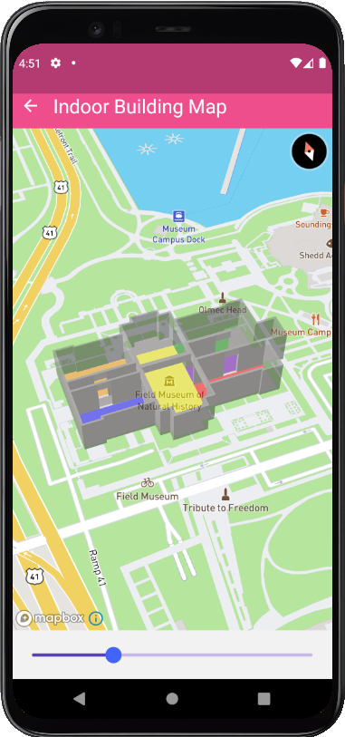
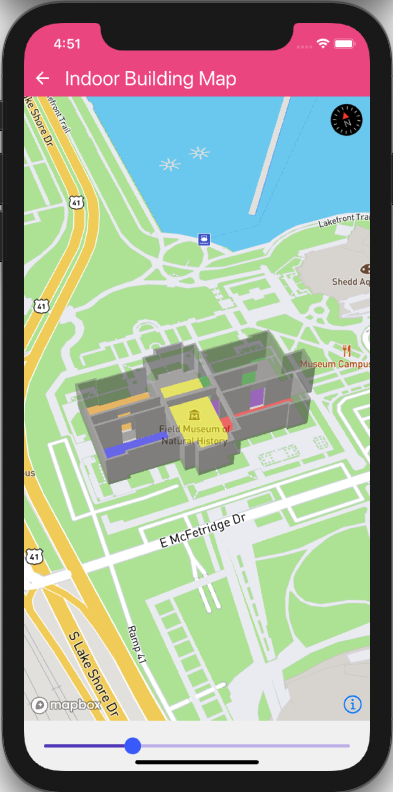

<br>

### 🟥 Future of this repo: participate in the [discussion thread](https://github.com/rnmapbox/maps/discussions/1680) 🟥

### 🟥 Call for additional maintainers [discussion thread](https://github.com/rnmapbox/maps/discussions/1551) 🟥

### 🟥 This README is for the unreleased 10* branch. Please see [v8 branch](https://github.com/rnmapbox/maps/tree/v8) for documentation on 8.* releases 🟥

<br>

---

<br>

# Mapbox Maps SDK for React Native

_An unofficial React Native library for building maps with   
the [Mapbox Maps SDK for iOS](https://www.mapbox.com/ios-sdk/) and [Mapbox Maps SDK for Android](https://www.mapbox.com/android-sdk/)_

At the moment the following implementations are supported: 


|*RNMapboxMapsImpl*|*Notes*|
|----------------|-----|
|mapbox|New [Mapbox v10](https://www.mapbox.com/mobile-maps-sdk) implementation (BETA)|
|maplibre|[MapLibre](https://github.com/maplibre/maplibre-gl-native) opensource fork of Mapbox SDKs|
|mapbox-gl|Legacy mapbox implementation [iOS](https://docs.mapbox.com/android/legacy/maps/guides/) [Android](https://docs.mapbox.com/ios/legacy/maps/guides/)|

_See [iOS](ios/install.md) & [Android](android/install.md) setup guide for more details on setting `RNMapboxMapsImpl`_


---

[](https://badge.fury.io/js/%40react-native-mapbox-gl%2Fmaps)  
[](https://github.com/rnmapbox/maps/actions/workflows/on-push.yml?branch=main)  

---

<br>




## Prerequisite

1. On Android we support from version 6 (API 23) upwards
2. Please [Sign Up to Mapbox](https://account.mapbox.com/auth/signup/) to get the Mapbox Access Token.


## Dependencies

- [node](https://nodejs.org)
- [npm](https://www.npmjs.com/)
- [React Native](https://facebook.github.io/react-native/) (0.60+)


## Installation

### Step 1 - Install Package:

```sh
# install with Yarn
# yarn add @rnmapbox/maps
yarn add rnmapbox/maps#main


# or install with NPM
# npm install @rnmapbox/maps --save
npm install rnmapbox/maps#main --save

```

### Step 2 - Installation Guides:

- [Android](/android/install.md)
- [iOS](/ios/install.md)
- [Expo](/plugin/install.md)
- [Example](/example)


### Getting Started
For more information, check out our [Getting Started](/docs/GettingStarted.md) section

## Run Project
Before you run your project be sure you have completeded the Installation Guides for Android or iOS.

### Run iOS Simulator
```sh
# Run with yarn
yarn run ios

# or Run with NPM
npm run ios
```

### Run Android Emulator
```sh
# Run with yarn
yarn run android

# or Run with NPM
npm run android
```

## Adding a map

```js
import React, { Component } from 'react';
import { StyleSheet, View } from 'react-native';
import MapboxGL from '@react-native-mapbox-gl/maps';

MapboxGL.setAccessToken('<YOUR_ACCESSTOKEN>');

const styles = StyleSheet.create({
  page: {
    flex: 1,
    justifyContent: 'center',
    alignItems: 'center',
    backgroundColor: '#F5FCFF'
  },
  container: {
    height: 300,
    width: 300,
    backgroundColor: 'tomato'
  },
  map: {
    flex: 1
  }
});

export default class App extends Component {
  render() {
    return (
      <View style={styles.page}>
        <View style={styles.container}>
          <MapboxGL.MapView style={styles.map} />
        </View>
      </View>
    );
  }
}
```

## Documentation

### Components

- [MapView](/docs/MapView.md)
- [Light](/docs/Light.md)
- [StyleSheet](/docs/StyleSheet.md)
- [PointAnnotation](/docs/PointAnnotation.md)
- [MarkerView](/docs/MarkerView.md)
- [Callout](/docs/Callout.md)
- [Camera](docs/Camera.md)
- [UserLocation](docs/UserLocation.md)
- [Images](docs/Images.md)

### Sources

- [VectorSource](/docs/VectorSource.md)
- [ShapeSource](/docs/ShapeSource.md)
- [RasterSource](/docs/RasterSource.md)
- [RasterDemSource](/docs/RasterDemSource.md)

### Layers

- [BackgroundLayer](/docs/BackgroundLayer.md)
- [CircleLayer](/docs/CircleLayer.md)
- [FillExtrusionLayer](/docs/FillExtrusionLayer.md)
- [FillLayer](/docs/FillLayer.md)
- [LineLayer](/docs/LineLayer.md)
- [RasterLayer](/docs/RasterLayer.md)
- [SymbolLayer](/docs/SymbolLayer.md)
- [HeatmapLayer](/docs/HeatmapLayer.md)
- [SkyLayer](/docs/SkyLayer.md)

### Terrain

- [Terrain](/docs/Terrain.md)

### Offline

- [OfflineManager](/docs/OfflineManager.md)
- [SnapshotManager](/docs/snapshotManager.md)

### Misc

- [MapboxGL](/docs/MapboxGL.md)
- [CustomHttpHeaders](/docs/CustomHttpHeaders.md)
- [Logger](/docs/Logger.md)

## Expo Support

This package is not available in the [Expo Go](https://expo.io/client) app. Learn how you can use it with [custom dev clients](/plugin/install.md).

## Testing with Jest

This library provides some mocks which are necessary for running tests.

Example:

```json
"jest": {
  "preset": "react-native",
  "setupFilesAfterEnv": ["@rnmapbox/maps/setup-jest"]
}
```

## Developer Group

Have a question or need some help? Join our [Gitter developer group](https://gitter.im/rnmapbox/Lobby)!
