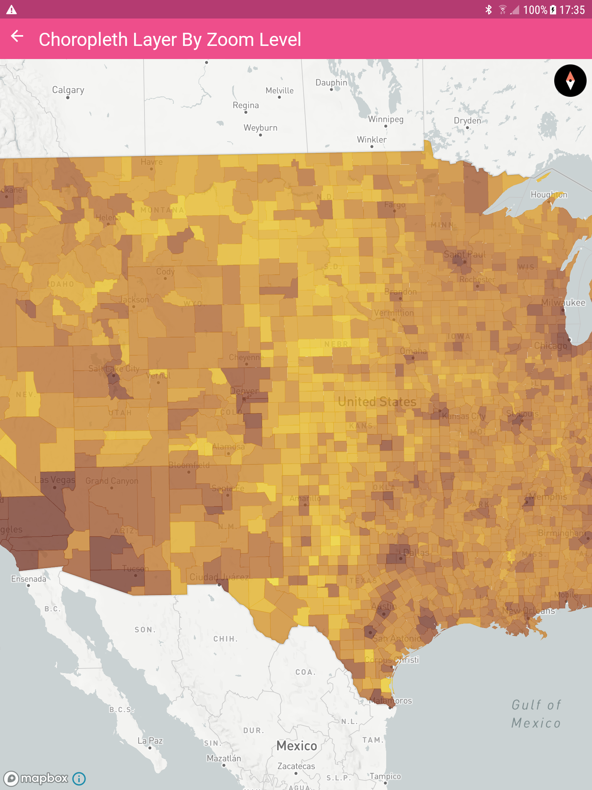
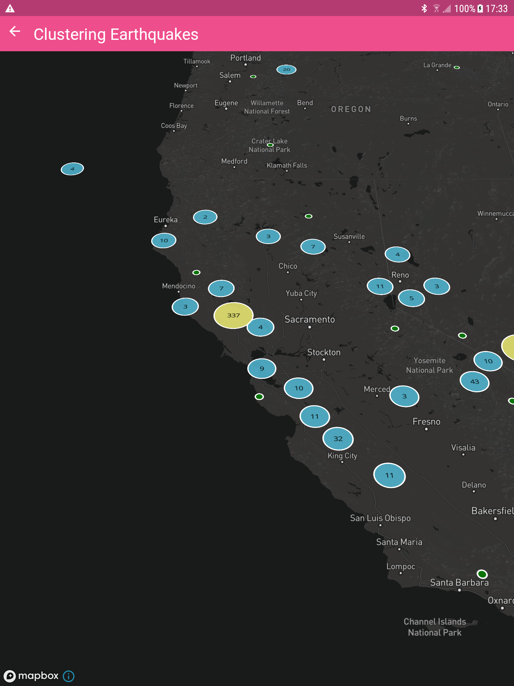
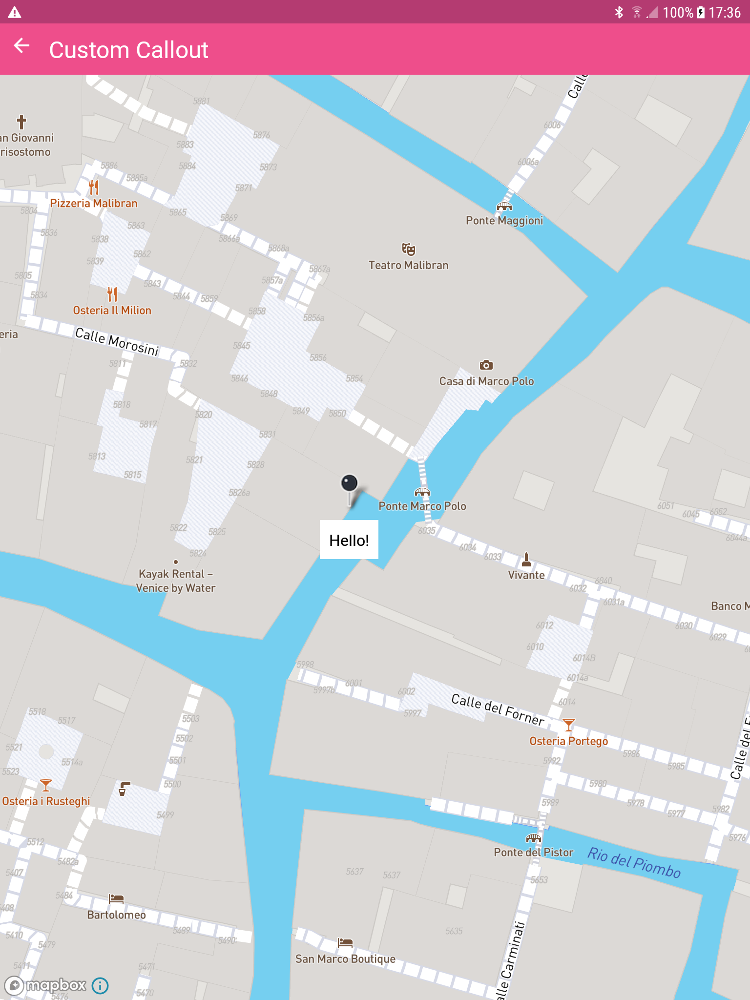
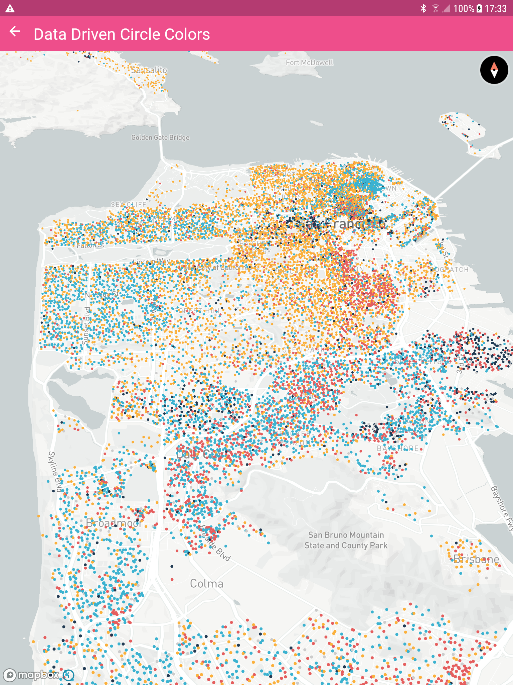

<p align="center">
  <a href="https://github.com/rnmapbox/maps/blob/main/example/src/examples/FillRasterLayer/ChoroplethLayerByZoomLevel.js">
    
  </a>
  <a href="https://github.com/rnmapbox/maps/blob/main/example/src/examples/SymbolCircleLayer/Earthquakes.tsx">
    
  </a>
  <a href="https://github.com/rnmapbox/maps/blob/main/example/src/examples/Annotations/CustomCallout.tsx">
    
  </a>
  <a href="https://github.com/rnmapbox/maps/blob/main/example/src/examples/SymbolCircleLayer/DataDrivenCircleColors.js">
    
  </a>
  <a href="https://github.com/rnmapbox/maps/blob/main/example/src/examples/FillRasterLayer/ImageOverlay.js">
    
  </a>
</p>

<br>


<a href="https://www.mapbox.com">
  
</a>

# React Native Mapbox Demo

Demo Application for [React Native Mapbox](../README.md)

*Note:* this app is using [non-trivial babel/metro configs](https://github.com/rnmapbox/maps/pull/778), so we can consume the `maps` library from parent directory directly. Regular apps don't need this complicated setup.

<br>

## What is Mapbox?

[Mapbox](https://www.mapbox.com/) is the location data platform for mobile and web applications.

<br>

## Sign up for Mapbox

Not a Mapbox user yet? [Sign up for an account here](https://www.mapbox.com/signup/). Once you’re signed in, all you need to start building is a Mapbox access token. Use this same short code with all of our interactive mapping libraries, Python and JavaScript SDKs, and directly against our REST APIs. You can create and manage your access tokens on your [Mapbox Account page](https://www.mapbox.com/account/).

<br>

## Installation

* Make sure you are in the example directory
```
cd example
```
* Create a file called `accesstoken` in the root of the example project and just paste in your [Mapbox access token](https://www.mapbox.com/studio/account/tokens/). (The `accesstoken` file is processed in postinstall, so you need to run `yarn install` after adding/changing accesstoken.)

* Install our dependencies using `yarn install`.

* Android: Set up your Mapbox developer keys as described in https://github.com/rnmapbox/maps/blob/main/android/install.md#adding-mapbox-maven-repo (no need to change build.gradle, just set up gradle.properties)

* iOS: 
  1. Set up your Mapbox developer keys as described in [https://github.com/rnmapbox/maps/blob/main/ios/install.md#adding-mapbox-maven-repo](https://github.com/rnmapbox/maps/blob/main/ios/install.md#mapbox-maps-sdk-v10) (add your cerdentials to .netrc as described)
  2. Install pod dependencies
    ```
    cd ios
    pod install
    ```


<br>


## Start React Native Packager (or not, it starts automatically 🤷‍♀️)

Open up another tab in your Terminal and run
```
yarn start
```

*Note*: if modules were added to base lib you might need to run `yarn start --reset-cache` because we're using `babel` to [rewrite imports](https://github.com/rnmapbox/maps/pull/778)

<br>

## Run Android Emulator

* Start Android emulator
* Run `yarn android` from `example` directory

### Common Issues

If the build fails make sure gradle has permission to build from cli
```
cd android
chmod +x gradlew
```

<br>

## Run iOS Simulator

You can run this with the react-native cli or Xcode

* Run `yarn ios` from `example` directory

### Common Issues

If you are using [`nvm`](https://github.com/nvm-sh/nvm), make sure you copy [ios/.xcode.env](./ios/.xcode.env) as `ios/.xcode.env.local` and modify as described inside the file.

If you run into

```
Command failed: /usr/libexec/PlistBuddy -c Print:CFBundleIdentifier build/Build/Products/Debug-iphonesimulator/RNMapboxGLExample.app/Info.plist
Print: Entry, ":CFBundleIdentifier", Does Not Exist
```

Just run the example from Xcode, it seems to be an [issue](https://github.com/facebook/react-native/issues/14423) with RN.
